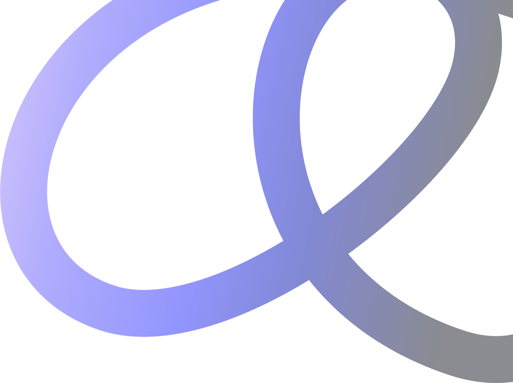
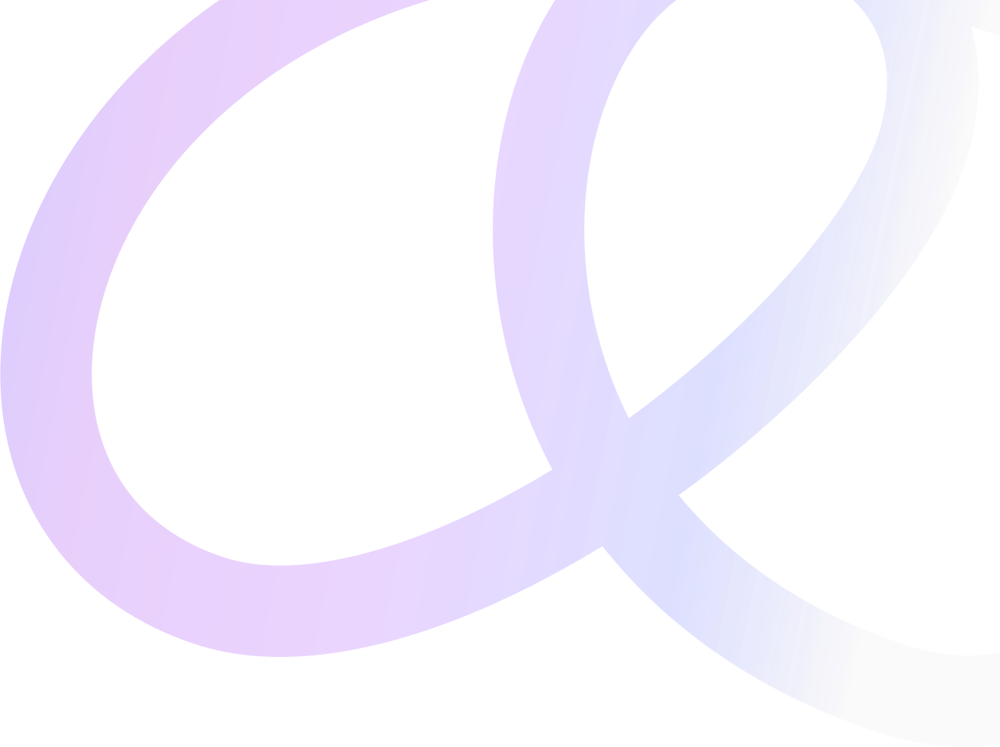

#### N00Icon

#### N01Icon

#### N02Icon

#### N03Icon

#### N04Icon

#### AccessDeniedDarkIcon

#### AccessDeniedLightIcon

#### AccountBalanceIcon

#### AccountBoxIcon

#### AccountCircleIcon

#### AccountTreeIcon

#### AddIcon

#### AddBoxIcon

#### AddCircleOutlineIcon

#### AddOutlineIcon

#### AnalyticsIcon

#### ArchiveIcon

#### ArrowBackIcon

#### ArrowDropDownIcon

#### AssignmentIcon

#### AssignmentTurnedInIcon

#### AttachFileIcon

#### AudioFileIcon

#### BgDarkIcon

#### BgLightIcon

#### BillEmptyIcon

#### BuildIcon

#### CalendarOutlineIcon

#### CancelIcon

#### CancelCircleOutlineIcon

#### CancelOutlineIcon

#### CategoryIcon

#### CheckIcon

#### CheckCircleOutlineIcon

#### CheckCloseFolderIcon

#### ChecksOutlineIcon

#### ChevronDownIcon

#### ChevronLeftIcon

#### ChevronLeftOutlineIcon

#### ChevronRightIcon

#### ChevronRightOutlineIcon

#### ChevronUpIcon

#### CloseIcon

#### CloseCircleIcon

#### CoinsIcon

#### ControlPointIcon

#### CorporateFareIcon

#### CupOutlineIcon

#### DarkModeIcon

#### DashboardIcon

#### DeleteIcon

#### DeleteOutlineIcon

#### DocumentArrowUpOutlineIcon

#### DocumentListOutlineIcon

#### DonateOutlineIcon

#### DoneIcon

#### DoneOutlineIcon

#### DoorArrowRightOutlineIcon

#### DownloadOutlineIcon

#### DragIndicatorIcon

#### EditIcon

#### EditOutlineIcon

#### ErrorOutlineIcon

#### EventNoteIcon

#### ExpandMoreIcon

#### FileIcon

#### FileDownloadIcon

#### FirstPageIcon

#### FlagIcon

#### FlagFillIcon

#### FormatAlignLeftIcon

#### GearsAlarmIcon

#### HandPaperIcon

#### HandymanIcon

#### HardwareIcon

#### HideImageIcon

#### HideOutlineIcon

#### HistoryIcon

#### HotelClassIcon

#### ImageIcon

#### ImgBoxFillIcon

#### InfoIcon

#### LastPageIcon

#### LightModeIcon

#### LocalFireDepartmentIcon

#### LocationMapOutlineIcon

#### LocationOnIcon

#### LockIcon

#### LockOpenIcon

#### MenuIcon

#### MoreVertIcon

#### NetworkErrorIcon

#### NoAssignmentIcon

#### NorthEastIcon

#### OutputIcon

#### PenOutlineIcon

#### PersonIcon

#### PersonOutlineIcon

#### PlayIcon

#### PlaylistAddCheckIcon

#### PriorityIcon

#### PublishIcon

#### RectangleSplit4UnevenOutlineIcon

#### RectanglesOutlineIcon

#### RefreshIcon

#### RestartAltIcon

#### RoomIcon

#### RotateLeftIcon

#### RotateRightIcon

#### RoundStrokedIcon

#### SaveIcon

#### SaveFillIcon

#### SearchIcon

#### SearchEmptyIcon

#### SettingsIcon

#### ShoppingBasketIcon

#### SignInBackgroundIcon

#### SmsFailedIcon

#### Square4OutlineIcon

#### StarsIcon

#### StraightenIcon

#### SubdirectoryArrowRightIcon

#### SupervisorAccountIcon

#### TableChartIcon

#### TargetOutlineIcon

#### TollIcon

#### TourIcon

#### TranslateIcon

#### UnlockIcon

#### UserIcon

#### VideoFileIcon

#### ViewListIcon

#### ViewOutlineIcon

#### ViewSidebarIcon

#### WarehouseIcon

#### WarningAmberIcon

#### WatchLaterIcon

#### WatchLaterOutlineIcon

#### WhatshotIcon

#### WorkspacesIcon

#### WriteIcon

#### ZoomOutMapOutlinedIcon
